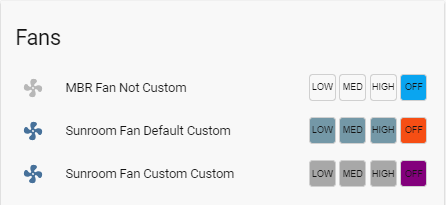
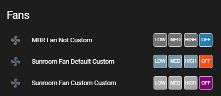
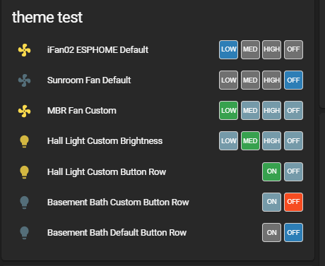

# Fan Control Entity Row

## This is an element to add a fan control row to Home Assistant.

It uses the code that can be found in my fan control package @ https://github.com/finity69x2/Home-Assistant/blob/master/packages/fan_package.yaml

UPDATE:

I've added the ability to hide the medium speed button to turn it into a two speed fan control, as well. To use it in this mode then your fan speeds must be designated low and high since it simply removes the medium speed button.

Installation:

The easiest way to install this is to use the Home Assistant Community Store (HACS) in Home Assistant.

Follow the instructions there for installation making sure you note the "url:" section for the resources addition.

Conversely, if you don't use HACS you can install it manually by performing the following:

Copy the fan-control-entity-row.js file to the appropriate folder in your Home Assistant Configuration directory (/config/www/).

Place the following in your "resources" section in your lovelace configuration (updating the localation to where you placed the above file):

  ```yaml
    - url: /local/fan-control-entity-row.js
      type: module
  ```
    
Then to use this in a card place the following in your entity card:


<b>Options:</b>

| Name | Type | Required | Default | Description |
| --- | --- | --- | --- | --- |
| entity | String | Yes | none | a fan entity_id |
| type | String | Yes | none | custom:fan-control-entity-row |
| name | String | No | none | A custom name for the entity in the row |
| customTheme | Boolean | No | false | set to true to use a custom theme |
| reverseButtons | Boolean | No | false | Set to true to reverse the button order |
| isTwoSpeedFan | Boolean | No | false | Set to true to hide the Medium Speed button |
| sendStateWithSpeed | Boolean | No | false | Used only for certain firmware that requires the State command be sent with the Speed command  |
| width | String | No | 30px | A custom width for the buttons |
| height | String | No | 30px | A custom height for the buttons |
| isOffColor | String | No | '#f44c09' | Sets the color of the 'Off' button if fan is off |
| isOnLowColor | String | No | '#43A047' | Sets the color of the 'Low' button if fan is on low |
| isOnMedColor | String | No | '#43A047' | Sets the color of the 'Med' button if fan is on Medium |
| isOnHiColor | String | No | '#43A047' | Sets the color of the 'Hi' button if fan is on high |
| buttonInactiveColor | String | No | '#759aaa' | Sets the color of the the buttons if that selection is off |
| customOffText | String | No | 'OFF' | Sets the text of the "off" button |
| customLowText | String | No | 'LOW' | Sets the text of the "low" speed button |
| customMedText | String | No | 'MED' | Sets the text of the "medium" speed button |
| customHiText | String | No | 'HIGH' | Sets the text of the "High" speed button |
| state_color | Boolean | No | false | Sets the icon color of the entity to reflect the current state |


The values for the colors can be any valid color string in "HEX", "RGB" or by color name.

*NOTE: The speeds that your fan uses in Home Assistant need to use all lowercase letters. The only time this should be a concern is if you are using a template fan. Be sure to make your speeds all lowercase in the fan configuration.

The optional "sendStateWithSpeed" config entry is only needed to be set to true if for some reason your fan needs the state command of "on" to be sent along with the desired speed command. As far as I know this is only needed for use with fans flashed with the ESPHome Firmware.

<b>Comfguration Examples:</b>
    
  ```yaml
    cards:
      - type: entities
        title: Fans
        show_header_toggle: false
        entities:
        ## USE THIS CONFIG TO HAVE IT MATCH YOUR THEME ##
          - entity: fan.master_bedroom_fan
            type: custom:fan-control-entity-row
            name: MBR Fan Not Custom
            customTheme: false
        ## USE THIS CONFIG TO USE A DEFAULT CUSTOM THEME
          - entity: fan.sunroom_fan
            type: custom:fan-control-entity-row
            name: Sunroom Fan Default Custom
            customTheme: true
        ## USE THIS CONFIG TO USE A 'CUSTOMZED' CUSTOM THEME
          - entity: fan.sunroom_fan
            type: custom:fan-control-entity-row
            name: Sunroom Fan Custom Custom
            reverseButtons: true
            customTheme: true
            isOnLowColor: 'rgb(255, 0, 0)'
            isOnMedColor: '#888888'
            isOnHiColor: '#222222'
            buttonInactiveColor: '#aaaaaa'
            isOffColor: 'purple'
        ## USE THIS CONFIG FOR USE WITH THE ESPHOME FIRMWARE (ALONG WITHE THE THEME SETTING ABOVE IF DESIRED)
          - entity: fan.master_bedroom_fan
            type: custom:fan-control-entity-row
            name: MBR Fan Not Custom
            sendStateWithSpeed: true
        ## USE THIS CONFIG TO SET CUSTOM BUTTON TEXT (NOT REQUIRED TO SET "customTheme: true" TO USE THESE )
          - entity: fan.sunroom_fan
            type: custom:fan-control-entity-row
            name: Sunroom Fan Custom Custom
            customHiText: me
            customLowText: do
            customMedText: re
            customOffText: not
            width: '15px'
            height: '15px'
  ```

This is with the default Lovelace frontend theme set:




This is with the "Slate" frontend theme set:



This is how this plugin looks with the Light Brightness Preset & Binary Button Rows:


